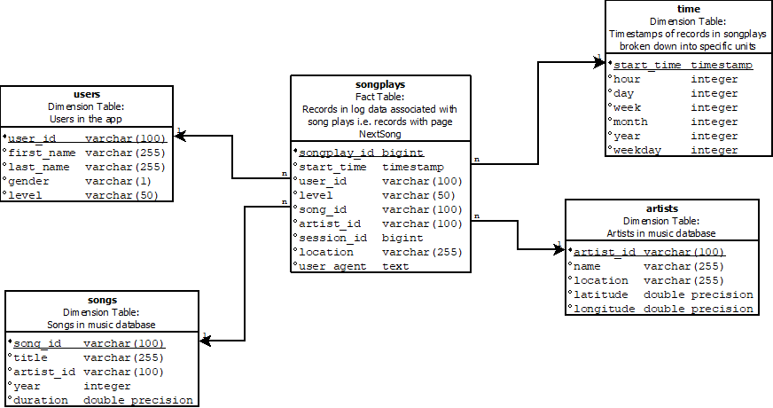

# Summary of project

Startup called Sparkify wants to analyze the data they've been collecting on songs and user activity on their new music streaming app. The analytics team is particularly interested in understanding what songs users are listening to. Currently, they don't have an easy way to query their data, which resides in a directory of JSON logs on user activity on the app, as well as a directory with JSON metadata on the songs in their app.

In order to enable Sparkify to analyze their data, a Relational Database Schema was created, which can be filled with an ETL pipeline.

# How to run the python scripts

To create the database tables and run the ETL pipeline, you must run the following two files in the order that they are listed below

To create tables:
```bash
python3 create_tables.py
```
To fill tables via ETL:
```bash
python3 etl.py
```

# Files in the repository


* **[data](data)**: Folder containing data of songs and logs 
* **[create_tables.py](create_tables.py)**: Python script to perform SQL-Statements for (re-)creating database and tables
* **[sql_queries.py](sql_queries.py)**: Python script containing SQL-Statements used by create_tables.py and etl.py
* **[etl.py](etl.py)**: Python script to extract the needed information from Song and Log data inside the data folder and parsing/inserting them to the created database schema and tables

# The purpose of this database

Using a database makes it easier to analyze the data. By using SQL and the star scheme, joins and aggregations, the data can be searched and summarized quickly and easily.  By using a relational database, Sparkify can also perform ad hoc analysis of its database. 

# The database schema design and ETL pipeline.

In order to enable Sparkify to analyze their data, a Relational Database Schema was created, which can be filled with an ETL pipeline.

The so-called star scheme enables the company to view the user behaviour over several dimensions.
The fact table is used to store all user song activities that contain the category "NextSong". Using this table, the company can relate and analyze the dimensions users, songs, artists and time.

In order to fill the relational database, an ETL pipeline is used, which makes it possible to extract the necessary information from the log files of the user behaviour as well as the corresponding master data of the songs and convert it into the schema.

* **Fact Table**: songplays
* **Dimension Tables**: users, songs, artists and time.



# Dataset used


* <b> /data </b> - Source of the JSON file, all these files have to be elaborated
  * <b> /log_data </b> - A folder that contains files of log files in JSON format generated by this [event simulator](https://github.com/Interana/eventsim) based on the songs in the dataset above. These simulate app activity logs from a music streaming app based on specified configurations.
  * <b> /song_data </b> -  Each file is in JSON format and contains metadata about a song and the artist of that song. The files are partitioned by the first three letters of each song's track ID
